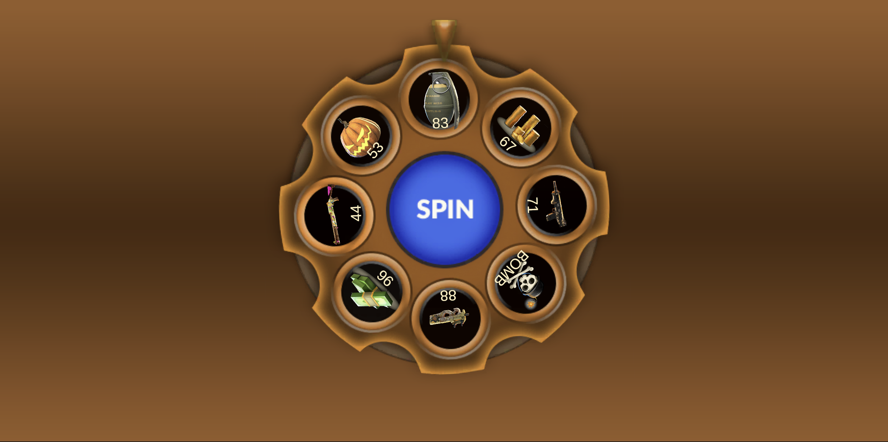

# Wheel of Fortune

<div align="center">

**A Unity-based wheel of fortune mobile game featuring progressive zones, strategic risk-reward mechanics, and clean architecture implementation.**



</div>

## Features

### Core Gameplay
- **Progressive Zone System**: Three difficulty zones (Bronze, Silver, Gold) with increasing rewards and bomb chances
- **Wheel Spinning Mechanics**: Smooth DOTween-based animations with customizable spin outcomes
- **Bomb & Revival System**: Strategic risk-reward gameplay with revival options
- **Reward Collection**: Track and collect multiple reward types (currency, items)
- **Haptic Feedback**: Platform-specific vibration patterns (iOS/Android)
- **Audio System**: Dynamic music and SFX with fade transitions
- **Cheat System**: Development tools for testing specific outcomes and zones

### Technical Features
- Clean Architecture with clear separation of concerns
- Dependency Injection for testability and maintainability
- State Machine for game flow management
- Object Pooling for performance optimization
- Event-driven architecture for loose coupling

---

## Architecture

The project follows a **clean architecture** approach with clear separation of concerns:

```
Assets/_Game/Scripts/
├── View/              # UI components and visual presentation
├── Presentation/      # Presenters, adapters, and installers
├── Infrastructure/    # Core services, DI, factories, interfaces
├── Data/              # ScriptableObjects and data models
└── Core/              # Business logic, services, state machine
```

### Key Layers

| Layer | Responsibility |
|-------|---------------|
| **View Layer** | MonoBehaviour components for UI/visual elements |
| **Presentation Layer** | Mediates between View and Core using Presenter pattern |
| **Core Layer** | Game logic, state management, and business rules |
| **Infrastructure Layer** | Cross-cutting concerns (DI, pooling, factories) |
| **Data Layer** | Configuration and runtime data models |

---

## Design Patterns

### Creational Patterns
- **Factory Pattern**: `GameFactory` for creating game context and dependencies
- **Object Pooling**: `RewardItemPool` for efficient reward view management

### Structural Patterns
- **Adapter Pattern**: `WheelViewAdapter`, `WheelSpinServiceAdapter` for interface adaptation
- **Facade Pattern**: `ScreenServiceFacade` for simplified screen management

### Behavioral Patterns
- **State Machine**: `WheelGameStateMachine` with `PlayingState` and `BombState`
- **Strategy Pattern**: Zone-specific strategies (`BronzeZoneStrategy`, `SilverZoneStrategy`, `SuperZoneStrategy`)
- **Observer Pattern**: Event-driven communication between View and Presenters

### Architectural Patterns
- **Service Locator**: `ServiceLocator` for dependency resolution
- **Dependency Injection**: Constructor injection throughout the core services
- **MVP (Model-View-Presenter)**: Clear separation between UI and business logic

---

## Project Structure

```
Wheel-Of-Fortune/
├── Assets/
│   ├── _Game/
│   │   ├── Art/              # Visual assets (sprites, UI, wheel graphics)
│   │   ├── Audio/            # Music and sound effects
│   │   ├── Data/             # ScriptableObjects (rewards, zones, profiles)
│   │   ├── Prefabs/          # Reusable game objects
│   │   ├── Scenes/           # Unity scenes
│   │   └── Scripts/          # C# source code
│   │       ├── Core/         # Business logic
│   │       ├── Data/         # Data models
│   │       ├── Infrastructure/ # Services and DI
│   │       ├── Presentation/  # Presenters and adapters
│   │       └── View/         # UI components
│   └── Plugins/
│       └── Demigiant/
│           └── DOTween/      # Animation library
└── ProjectSettings/          # Unity project configuration
```

---

## Game Mechanics

### Zone System
- **Bronze Zone**: Lower risk, smaller rewards
- **Silver Zone**: Medium risk, medium rewards
- **Gold Zone**: Higher risk, larger rewards

### Wheel Spinning
- Animated wheel spins using DOTween
- Configurable spin duration and easing
- Visual feedback on outcome

### Bomb System
- Random bomb appearances increase with zone difficulty
- Revival options available
- Strategic decision-making element

---

## Development Tools

The project includes a cheat system for development and testing:
- Force specific zone selection
- Control spin outcomes
- Test reward systems
- Debug state machine transitions

---

**Unity Assets:**
- DOTween by Demigiant
- TextMesh Pro by Unity Technologies

---

<div align="center">

⭐ Star this repo if you find it interesting!

</div>
